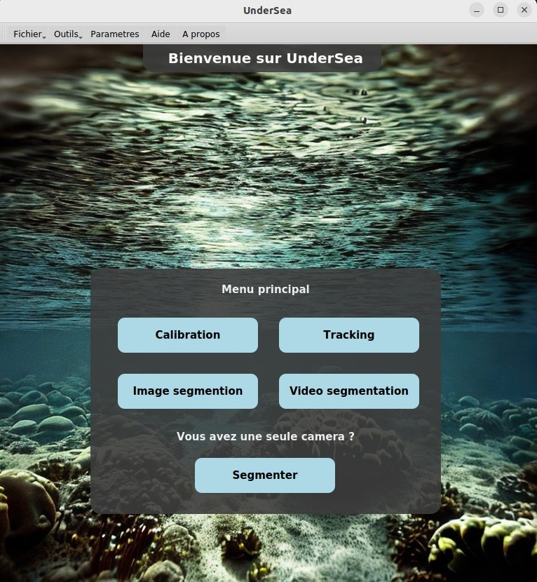

# Underwater-image-analysis
Portal of numerical methods for the analysis of underwater temporal sequences

This project is a python application that includes the Detectron2 library and a graphical interface. The objective of this project is to extract the characteristics of some underwater species and to follow their evolution in time. This project aims to allow all users, even those who do not know programming, to use the interface.
<p align="center">
  
</p>
## Prerequisites
Python 3.x
Python libraries: Detectron2, PySide2, etc.

## Installation
### Application executable : 
To come ...

### Conda
1. Create a new conda environment and activate the
2. Clone the project on your environment using the following command:

```
git clone https://github.com/LounesAl/underwater-image-analysis.git
```

2. Install the required libraries using the following command:
```
pip install -r requirements_gpu.txt
```

or

```
pip install -r requirements_cpu.txt
```

## Usage
1. Open a terminal and access the project directory.
2. Run the Interface.py file with the following command:
```
python interface.py
```
3. Use the graphical interface to interact with the data.

## Contribute
We welcome contributions to improve this project. Please refer to our contribution guide for more information.

License
Please refer to the license file for more information.


## Sample results

### Detection and segmentation of the underwater species ACTINIA
https://user-images.githubusercontent.com/84065830/236916655-9a73bdfe-2332-4326-ab7e-5349436e94f3.mp4

### Detection and segmentation of the underwater species GIBBULA
https://user-images.githubusercontent.com/84065830/236916238-7bcfc034-1615-4771-870c-d9778cc19335.mp4

### Detection and size estimation of the underwater species GIBBULA
https://user-images.githubusercontent.com/84065830/236915152-b96cee48-3c97-435b-b602-1db6dc52dfcd.mp4


